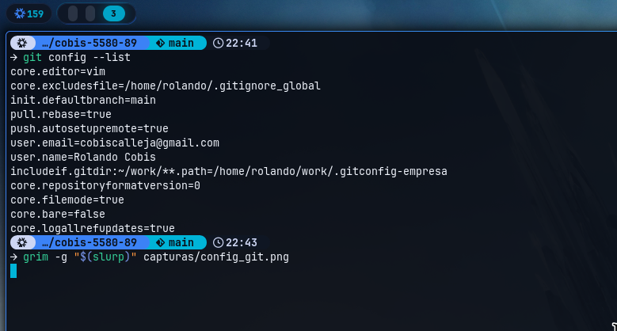

# Laboratorio 1: Configuración de Entorno y Control de Versiones (Git & GitHub)

**Universidad Nacional del Comahue. Centro Regional Zona Atlántica**
Tecnicatura Universitaria en Desarrollo Web
Asignatura: Programación Estática y Laboratorio Web

## Información del Alumno

| | |
| :--- | :--- |
| **Nombre y Apellido** | Rolando Cobis |
| **Legajo/Matrícula** | CURZA-9389 |
| **Últimos 4 dígitos del DNI** | 5580 |
| **Token Único de Verificación** | `cobis-5580-89` |
| **Fecha de Entrega** | 2026-08-31 |
| **Repositorio de GitHub** | https://github.com/cRolandoJr/peylw-2026-practicos-cobis-5580-89 |
| **Sitio publicado (GitHub Pages)** | https://cRolandoJr.github.io/peylw-2026-practicos-cobis-5580-89/ |

## Contenido

```
peylw-2026-practicos-cobis-5580-89/
├── index.html      página básica con el nombre y el token
├── README.md       esta carátula
├── REFLEXION.md    respuestas de la reflexión aplicada
└── capturas/
    └── config_git.png
```

## Configuración local de Git



### Aclaración sobre el entorno

El equipo utilizado corre **NixOS**, donde la configuración de usuario es **declarativa**:
el archivo `~/.config/git/config` no es un archivo editable sino un enlace simbólico de
solo lectura, generado a partir de una definición en `home-manager`. Por ese motivo el
comando `git config --global user.name "..."` falla en este sistema con
`error: no se pudo bloquear archivo de configuración`, ya que Git resuelve el enlace e
intenta escribir sobre el almacén de paquetes, que es de solo lectura.

Los valores pedidos por la consigna están igualmente configurados, y se verifican con
`git config --list` según muestra la captura. La declaración equivalente al comando del
enunciado es:

```nix
programs.git = {
  enable = true;
  settings = {
    user.name = "Rolando Cobis";
    user.email = "cobiscalleja@gmail.com";
  };
};
```

---

# Laboratorio 2: Estructura y Semántica Web con HTML5

| | |
| :--- | :--- |
| **Nombre y Apellido** | Rolando Cobis |
| **Legajo/Matrícula** | CURZA-9389 |
| **Últimos 4 dígitos del DNI** | 5580 |
| **Token Único** | `cobis-5580-89` |
| **Fecha de Entrega** | 2026-09-07 |
| **Repositorio de GitHub** | https://github.com/cRolandoJr/peylw-2026-practicos-cobis-5580-89 |
| **Página en GitHub Pages** | https://crolandojr.github.io/peylw-2026-practicos-cobis-5580-89/ |

## Contenido del TP2

```
├── index.html      página de bienvenida
├── acercade.html   biografía, figura e imagen
├── styles.css      hoja de estilos básica vinculada
└── img/
    └── rolando-cobis.png
```

## Estructura semántica utilizada

| Etiqueta | Dónde | Para qué |
| :--- | :--- | :--- |
| `<header>` | ambas | Cabecera con el `<h1>` del portal |
| `<nav>` | ambas | Lista de navegación entre las dos páginas |
| `<main>` | ambas | Contenido principal, único por documento |
| `<section>` | ambas | Bloques temáticos con su propio encabezado |
| `<article>` | acercade | La biografía, que es contenido autocontenido |
| `<figure>` / `<figcaption>` | acercade | La imagen junto a su descripción |
| `<footer>` | ambas | Derechos, nodo universitario y token |
